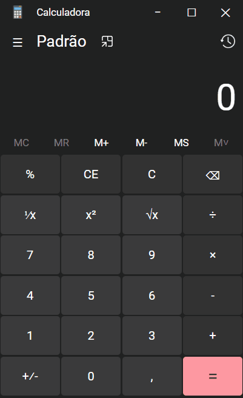

# Réplica da Calculadora do Windows

Este é o meu primeiro "grande" projeto de HTML, CSS e Javascript.

Eu comecei esse projeto para me familiarizar melhor com essas linguagens a cima, utilizando o HTML e CSS para criara a design da calculadora e o Javascript para criar as suas funcionalidades.

A calculadora possui todas as funcionalidades básicas da calculadora do Windows, mas também possui o histórico e memória. 

Para deixar o projeto mais interessante e aprender a manipular o DOM, eu criei a funcionalidades de movimentar, minimizar, maximizar e fechar a calculadora.

No futuro pretendo adicionar novos elementos, como calculadora de bit, calculadora científica, etc..

## Funcionalidades

- Adição, subtração, divisão e Multiplicação
- Operações com casa decimal e números negativos
- Potência de x, raiz de x e 1 divido por x
- Limpar o número e a operação no display da calculadora
- Histórico das operações executadas
- Mémoria para armazenar números desejados
- Movimentar, minimizar, maximizar e fechar a calculadora

## Demonstração

- Operações básicas
  

## Melhorias futuras

- Adicionar a opção de o usuário digitar os valores da calculadora ao invés de clicar nos botões
- Adicionar as outras calculadoras presente na calculadora do Windows, como calculadora de bit, científica, conversão de moedas, etc..
